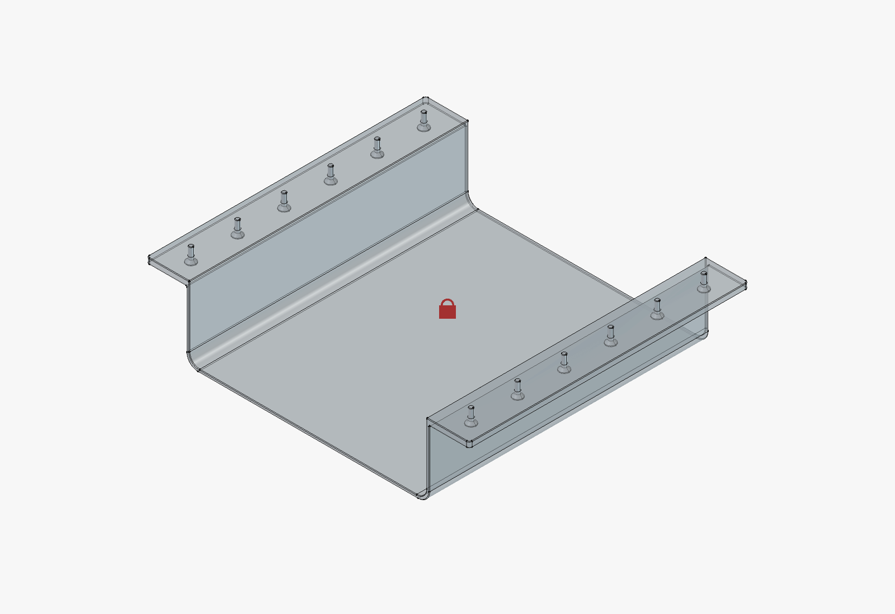
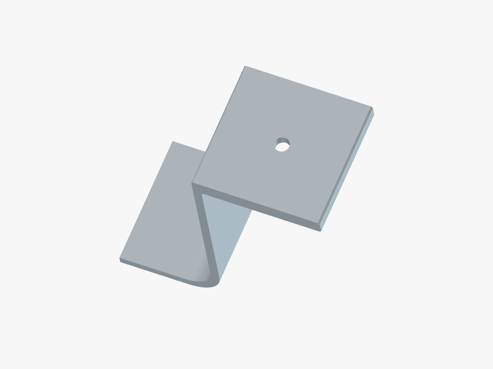
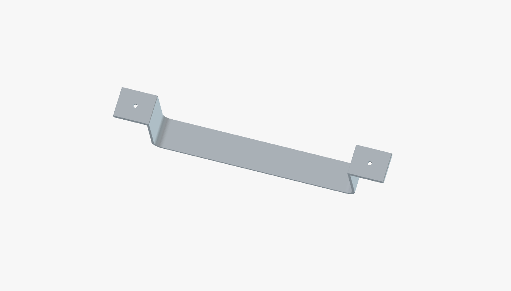

# Lockbox Bracket

A parametric FreeCAD bracket that holds a lockbox **under a desk**: an open-ended U-channel the
box slides into lengthwise, with an outward mounting flange along the top of each side wall
drilled for countersunk M3×10 fasteners that run up into the desk.



| | |
|---|---|
| **Envelope** | 225.5 × 195 × 52 mm |
| **Interior cavity** | 165.5 × 195 × 46 mm |
| **Wall / floor** | 2.0 mm |
| **Flanges** | 30 mm wide × 4 mm thick, full depth, both sides |
| **Fasteners** | `NumHoles` × M3×10 countersunk per flange, both flanges (3.4 mm bore, 6.7 mm × 90° c'sink) — **8 total at `NumHoles = 4`** |
| **Volume** | 146 908.44 mm³ |
| **CAD** | FreeCAD 1.1.3, PartDesign, single body + Assembly |

## Status

Model is complete, valid, and **passes the parametric audit**. One watertight solid, all
sketches fully constrained and attached to origin planes, every live dimension bound to the
`VarSet`.

Remediated 2026-09-17: symmetric hole spacing driven by one formula, holes mirrored onto both
flanges via a sketch symmetry constraint, and `2 × NumHoles` screws seated in the bores.
Flexing `NumHoles` returns the volume to its baseline exactly. **`VarSet.Depth` (the channel length, not
`Hole.Depth`) needs care — a large jump can silently drop holes, because the hole's position
uses an unsigned distance constraint. Change it in small steps and re-check the bore count;
see the red warning in `CLAUDE.md`.**

**No successful test print yet.** Start with the test pieces rather than the 3½ hour part:

| File | Size | Tests |
|---|---|---|
| `stl/Lockbox Bracket-cornertest.stl` | 52 × 30 × 52 mm, **5.2%** of the part | M3 screw fit in a horizontal bore, wall + flange thickness, corner fillet |
| `stl/Lockbox Bracket-testcoupon.stl` | 225.5 × 25 × 52 mm, **12.8%** | the above **plus the interior width** — does the box drop between the walls |
| `stl/Lockbox Bracket.stl` | full part | — |

The width test is kept shallow on purpose: full width is the only way to check the box fit,
but the depth is trimmed to the minimum that still holds a bore and stays stiff enough not to
flex and give a false reading. Interior width is **165.50 mm**.

| Corner test (5.2%) | Width test (12.8%) |
|---|---|
|  |  |

Print the test pieces **in the same orientation as production** (depth axis vertical) so the
bores print horizontally exactly as they will in the real part — that is what makes the
screw-fit test meaningful.

`3mf/Lockbox Bracket.3mf` is a Creality Print project carrying the current settings (PETG,
4 walls), but its **geometry is stale** — it predates the drop to 8 holes. Re-import the STL
into that project and re-slice.

## Layout

```
Lockbox Bracket.FCStd     the part — Body plus an in-document VarSet
intent.md                 design goal and constraints (draft — needs confirmation)
plan.md                   remediation plan; execution waits on approval
CLAUDE.md                 project rules, assembly architecture, known traps
3mf/                      slicer-ready print files
stl/                      STL exports
gcode/                    slicer output (gitignored, regenerable)
images/                   renders and screenshots
macros/                   project .FCMacro files
scripts/audit_parametric.py   parametric compliance audit
```

## Exporting print files

Run `macros/export_print_files.FCMacro`. It writes `stl/Lockbox Bracket.stl` and
`3mf/Lockbox Bracket.3mf` from the bracket **Body only**.

> **Do not export with the Assembly selected.** The community
> `3D_Printer_3mf_Workflow.FCMacro` exports the current selection, so it will mesh the twelve
> M3×10 screws into the print file. `export_print_files` pins the selection to `Body` and
> leaves it selected, so you can run the workflow macro straight afterwards for its
> slicer-settings round-trip.

## Changing the hole count

`NumHoles` drives the spacing, both flanges, and the screws. After changing it:

1. Recompute the Body — the bores re-space symmetrically on their own.
2. Re-run `macros/place_screws.FCMacro` so the screw set matches the new bore count. It reads
   bore positions from the solid, so it cannot drift from the geometry.

There is **no `Params.FCStd`** — this single-document project deliberately keeps its VarSet
in-document. See the deviation note in [`CLAUDE.md`](CLAUDE.md) before "fixing" that.

## Working on this model

Open the FCStd in FreeCAD and drive everything from the `VarSet`. Never edit sketch
coordinates directly — adjust the driving variable or add a constraint bound to one.

Before committing any change:

```bash
python3 scripts/audit_parametric.py
```

A clean audit is necessary but not sufficient — the script has documented blind spots listed
in `CLAUDE.md`.

Conforms to `PROJECT_BOOTSTRAP.md` and `CAD_STANDARDS.md` in the parent workspace.
